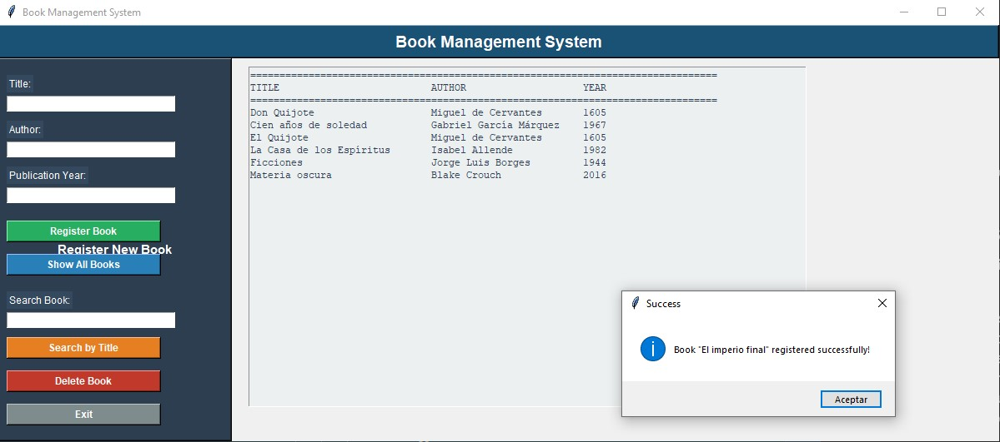
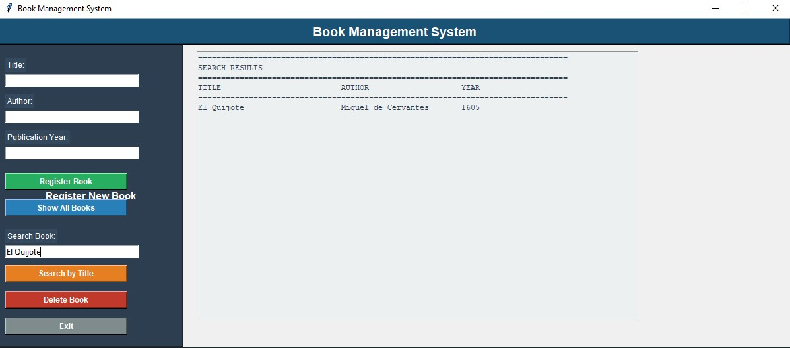
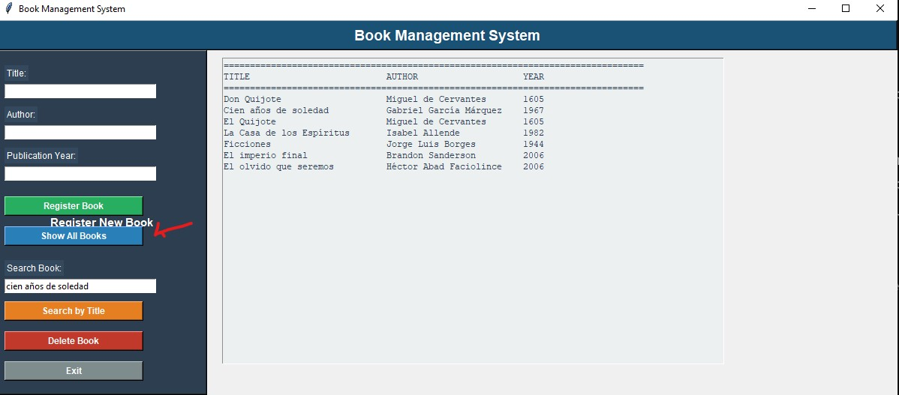
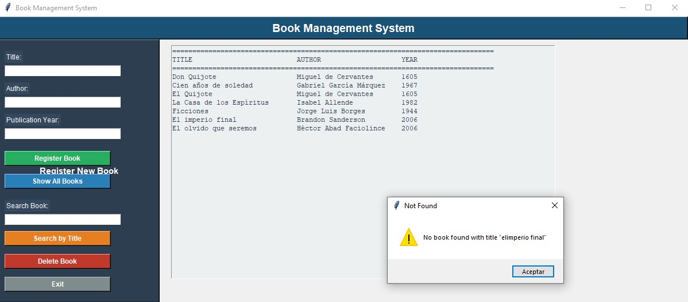
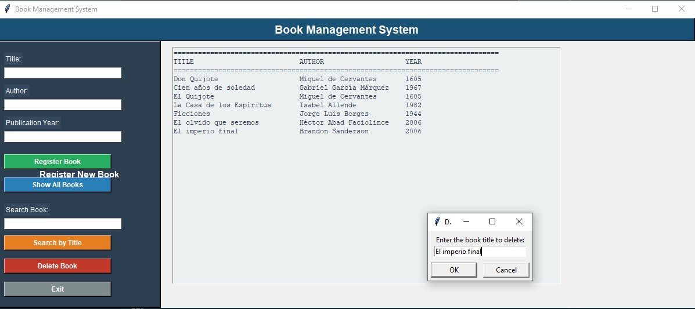
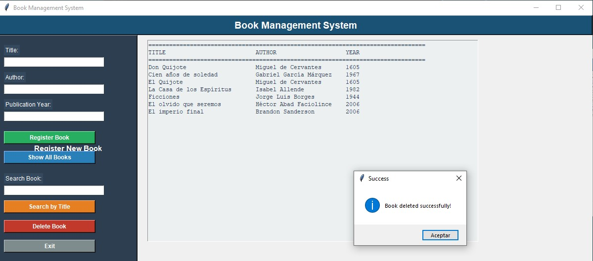
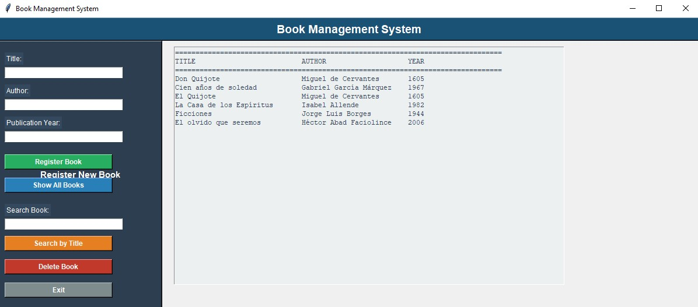
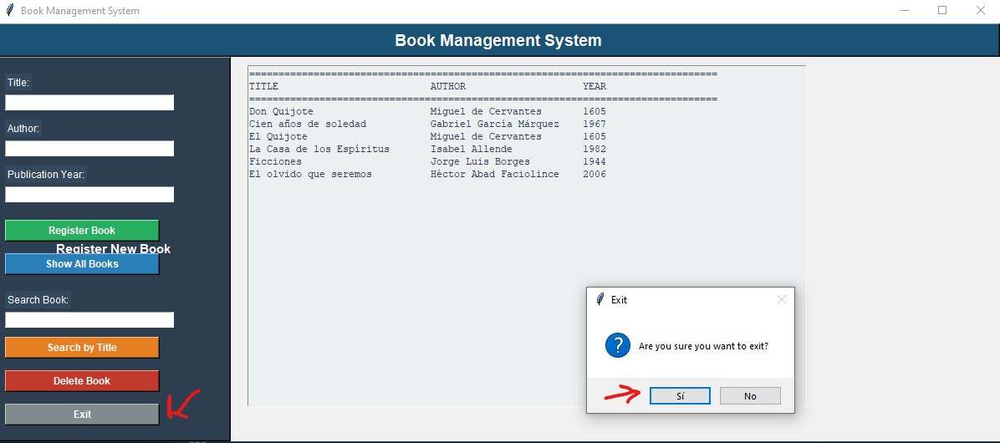

## 📚 Biblioteca System

Sistema de gestión de libros desarrollado en Python con interfaz gráfica usando Tkinter. Permite registrar, buscar, visualizar y eliminar libros almacenando la información en archivos JSON.

---

## 🚀 Características

✅ Registro de nuevos libros  
✅ Visualización de todos los libros registrados  
✅ Búsqueda de libros por título  
✅ Eliminación de libros  
✅ Almacenamiento automático de datos  
✅ Validación de campos y datos ingresados  
✅ Interfaz gráfica amigable  

---

## 🛠 Tecnologías utilizadas

- Python
- Tkinter
- JSON
- Visual Studio Code

---

## 📂 Estructura del proyecto

```bash
biblioteca/
│
├── project.py
├── books.json
├── test_books.py
├── comentarios.txt
├── README.md
```

---

## ⚙️ Instalación

### 1. Clonar repositorio

```bash
git clone https://github.com/BrayneL87/biblioteca.git
```

Entrar al directorio:

```bash
cd biblioteca
```

---

## ▶️ Ejecutar el proyecto

Ejecuta el archivo principal:

```bash
python project.py
```

---

## 💾 Almacenamiento de datos

La información se guarda automáticamente en:

```bash
books.json
```

El archivo almacena:

- Título del libro
- Autor
- Año de publicación

Ejemplo:

```json
[
    {
        "title":"Python Básico",
        "author":"John Doe",
        "year":2025
    }
]
```

---

## 📸 Capturas de pantalla

Agrega imágenes de tu aplicación aquí:

### Registro de libros


### Guardar de libros



### Buscar libros



### Ver Lista Libros



### Borrar libro


### Titulo incorrecto no Borrar libro



### Titulo correcto Borrar libro



### Aceptar Borrar libro



### Desparece de la lista registrada



### Salir




---

## 🔮 Mejoras futuras

- Editar información de libros
- Agregar categorías
- Sistema de usuarios
- Exportar información a PDF
- Integrar base de datos MySQL

---

## 👨‍💻 Autor

Desarrollado por **Braynel Yecid**

GitHub:

https://github.com/BrayneL87

---

## 📄 Licencia

Proyecto desarrollado con fines educativos y de aprendizaje.